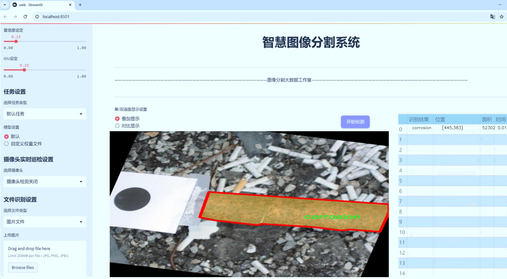
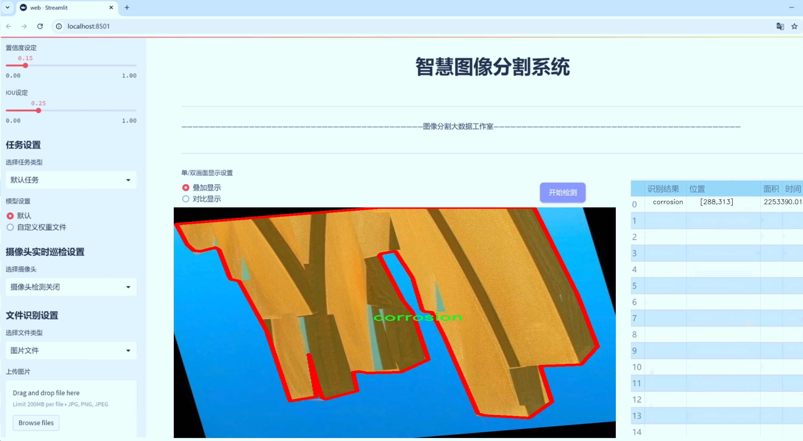
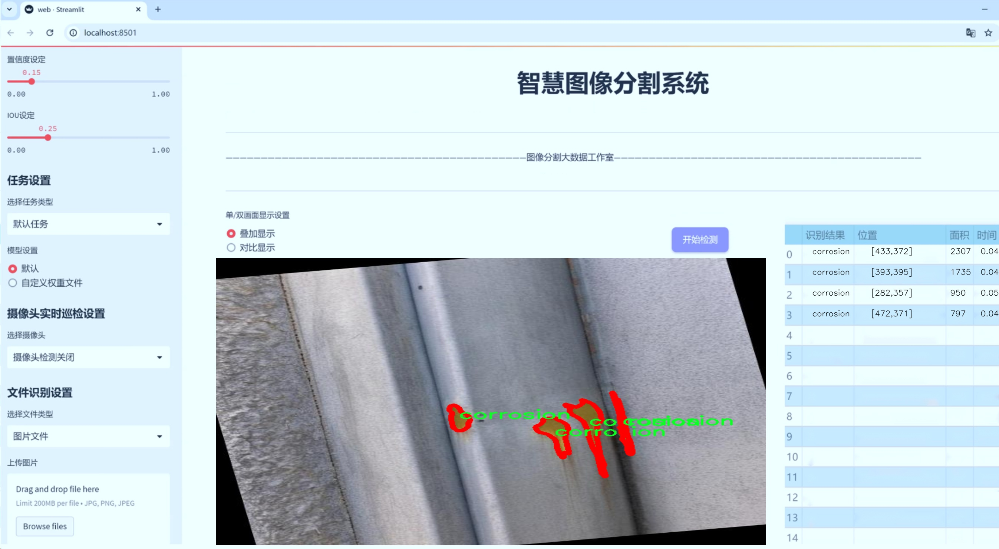
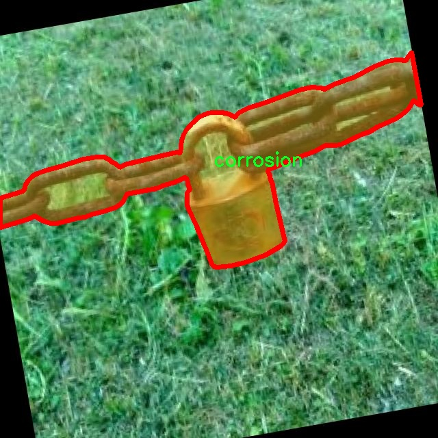
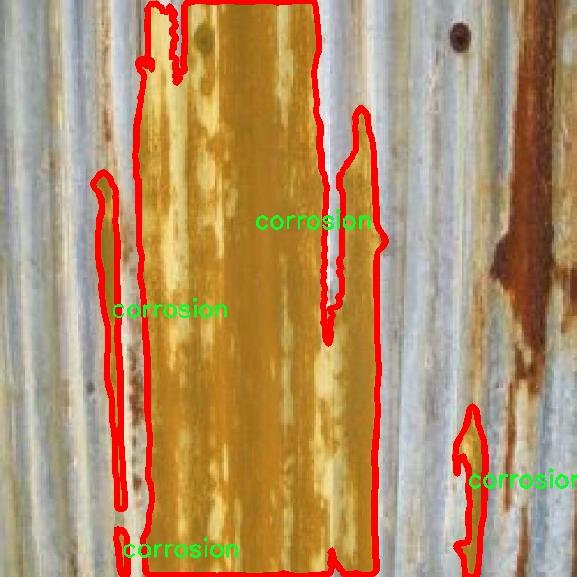
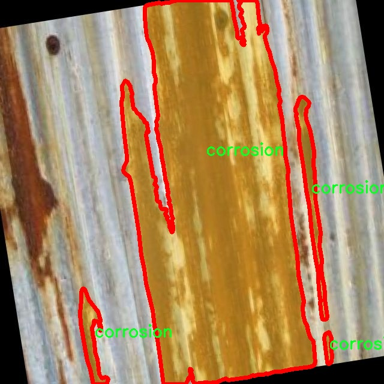
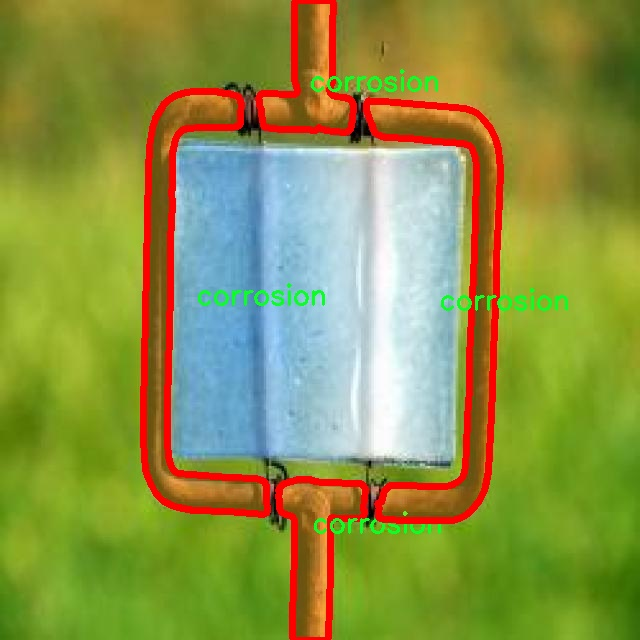
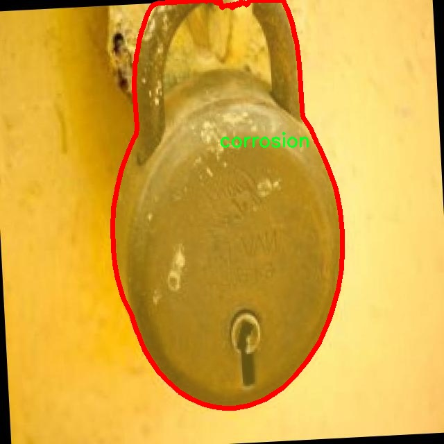

# 腐蚀图像分割系统： yolov8-seg-C2f-Parc

### 1.研究背景与意义

[参考博客](https://gitee.com/YOLOv8_YOLOv11_Segmentation_Studio/projects)

[博客来源](https://kdocs.cn/l/cszuIiCKVNis)

研究背景与意义

随着工业化进程的加快，腐蚀问题日益严重，尤其在石油、化工、建筑等领域，腐蚀不仅会导致设备的损坏和安全隐患，还会造成巨大的经济损失。因此，及时、准确地检测和分割腐蚀区域，对于维护设备安全、延长使用寿命具有重要意义。传统的腐蚀检测方法多依赖人工视觉检查和经验判断，这不仅效率低下，而且容易受到主观因素的影响，导致漏检和误检现象频发。近年来，随着计算机视觉和深度学习技术的快速发展，基于图像处理的自动化腐蚀检测方法逐渐成为研究热点。

YOLO（You Only Look Once）系列模型因其在目标检测任务中的高效性和准确性而受到广泛关注。YOLOv8作为该系列的最新版本，进一步提升了检测精度和速度，适用于实时应用场景。然而，针对腐蚀图像的分割任务，现有的YOLOv8模型在处理细节和复杂背景方面仍存在一定的局限性。因此，基于改进YOLOv8的腐蚀图像分割系统的研究显得尤为重要。

本研究所使用的数据集包含4400幅图像，专注于腐蚀这一单一类别，具有较高的针对性和专业性。通过对该数据集的深入分析和处理，可以为腐蚀图像分割任务提供丰富的训练样本，进而提高模型的泛化能力和分割精度。数据集的规模和质量为模型的训练提供了良好的基础，能够有效支持深度学习算法的优化和改进。

在研究过程中，我们将对YOLOv8模型进行多方面的改进，包括网络结构的优化、损失函数的调整以及数据增强技术的应用。这些改进旨在提高模型对腐蚀图像的分割能力，使其能够在复杂背景下准确识别和分割腐蚀区域。此外，结合实例分割技术，可以实现对腐蚀区域的精细化处理，为后续的分析和决策提供更为可靠的数据支持。

本研究的意义不仅在于提升腐蚀图像分割的技术水平，更在于为工业界提供一种高效、自动化的腐蚀检测解决方案。通过实现实时、准确的腐蚀检测，能够有效降低人工成本，提高工作效率，进而为设备的安全运行和维护提供保障。此外，该研究成果还可为其他领域的图像分割任务提供借鉴，推动计算机视觉技术在更多实际应用中的落地。

综上所述，基于改进YOLOv8的腐蚀图像分割系统的研究，具有重要的理论价值和广泛的应用前景。通过对腐蚀图像的精准分割，不仅能够提升腐蚀检测的效率和准确性，还将为相关领域的技术进步和产业发展提供有力支持。

### 2.图片演示







注意：本项目提供完整的训练源码数据集和训练教程,由于此博客编辑较早,暂不提供权重文件（best.pt）,需要按照6.训练教程进行训练后实现上图效果。

### 3.视频演示

[3.1 视频演示](https://www.bilibili.com/video/BV1YgBsYoEKG/)

### 4.数据集信息

##### 4.1 数据集类别数＆类别名

nc: 1
names: ['corrosion']


##### 4.2 数据集信息简介

数据集信息展示

在本研究中，我们采用了名为“Corrosion Segmentation”的数据集，以训练和改进YOLOv8-seg模型，旨在提升腐蚀图像的分割效果。该数据集专注于腐蚀现象的识别与分割，具有重要的应用价值，尤其是在工业检测、材料科学和结构健康监测等领域。通过对腐蚀图像的精确分割，能够有效地评估材料的损伤程度，进而为维护和修复提供科学依据。

“Corrosion Segmentation”数据集的类别数量为1，具体类别为“corrosion”。这一单一类别的设置使得数据集在特定任务上具有高度的专注性，便于模型在腐蚀图像分割方面进行深入学习。尽管类别数量有限，但数据集中的图像涵盖了多种不同类型和程度的腐蚀现象，包括但不限于表面锈蚀、剥落、裂纹等。这种多样性为模型提供了丰富的训练样本，使其能够学习到不同腐蚀特征的表现形式，从而提升分割的准确性和鲁棒性。

数据集的构建过程经过严格的筛选和标注，确保每一幅图像都经过专业人员的审核。图像的标注采用了精细的像素级分割方式，使得模型能够准确地识别出腐蚀区域的边界。这种高质量的标注不仅提高了模型的训练效果，也为后续的评估和验证提供了可靠的基础。数据集中包含的图像来源广泛，涵盖了不同环境、不同材料以及不同光照条件下的腐蚀实例，增强了模型的泛化能力。

在数据预处理阶段，我们对图像进行了标准化处理，包括尺寸调整、颜色归一化等，以确保输入数据的一致性。此外，为了提高模型的鲁棒性，我们还应用了数据增强技术，如随机裁剪、旋转、翻转等，生成更多的训练样本。这些增强操作不仅丰富了数据集的多样性，还有效地减少了模型对特定样本的过拟合风险。

在模型训练过程中，我们将“Corrosion Segmentation”数据集划分为训练集和验证集，以便于对模型的性能进行评估。训练集用于模型的学习，而验证集则用于监测模型在未见数据上的表现。通过这种方式，我们能够及时调整模型参数，优化训练过程，确保最终得到一个性能优越的腐蚀图像分割系统。

总之，“Corrosion Segmentation”数据集为本研究提供了坚实的基础，助力于改进YOLOv8-seg模型在腐蚀图像分割任务中的表现。通过高质量的标注、丰富的样本多样性以及有效的数据处理和增强策略，我们期望能够实现对腐蚀现象的精准识别与分割，为相关领域的研究和应用提供有力支持。











### 5.项目依赖环境部署教程（零基础手把手教学）

[5.1 环境部署教程链接（零基础手把手教学）](https://www.bilibili.com/video/BV1jG4Ve4E9t/?vd_source=bc9aec86d164b67a7004b996143742dc)


[5.2 安装Python虚拟环境创建和依赖库安装视频教程链接（零基础手把手教学）](https://www.bilibili.com/video/BV1nA4VeYEze/?vd_source=bc9aec86d164b67a7004b996143742dc)

### 6.手把手YOLOV8-seg训练视频教程（零基础手把手教学）

[6.1 手把手YOLOV8-seg训练视频教程（零基础小白有手就能学会）](https://www.bilibili.com/video/BV1cA4VeYETe/?vd_source=bc9aec86d164b67a7004b996143742dc)


按照上面的训练视频教程链接加载项目提供的数据集，运行train.py即可开始训练



     Epoch   gpu_mem       box       obj       cls    labels  img_size
     1/200     0G   0.01576   0.01955  0.007536        22      1280: 100%|██████████| 849/849 [14:42<00:00,  1.04s/it]
               Class     Images     Labels          P          R     mAP@.5 mAP@.5:.95: 100%|██████████| 213/213 [01:14<00:00,  2.87it/s]
                 all       3395      17314      0.994      0.957      0.0957      0.0843

     Epoch   gpu_mem       box       obj       cls    labels  img_size
     2/200     0G   0.01578   0.01923  0.007006        22      1280: 100%|██████████| 849/849 [14:44<00:00,  1.04s/it]
               Class     Images     Labels          P          R     mAP@.5 mAP@.5:.95: 100%|██████████| 213/213 [01:12<00:00,  2.95it/s]
                 all       3395      17314      0.996      0.956      0.0957      0.0845

     Epoch   gpu_mem       box       obj       cls    labels  img_size
     3/200     0G   0.01561    0.0191  0.006895        27      1280: 100%|██████████| 849/849 [10:56<00:00,  1.29it/s]
               Class     Images     Labels          P          R     mAP@.5 mAP@.5:.95: 100%|███████   | 187/213 [00:52<00:00,  4.04it/s]
                 all       3395      17314      0.996      0.957      0.0957      0.0845


### 7.50+种全套YOLOV8-seg创新点加载调参实验视频教程（一键加载写好的改进模型的配置文件）

[7.1 50+种全套YOLOV8-seg创新点加载调参实验视频教程（一键加载写好的改进模型的配置文件）](https://www.bilibili.com/video/BV1Hw4VePEXv/?vd_source=bc9aec86d164b67a7004b996143742dc)

### YOLOV8-seg算法简介

原始YOLOV8-seg算法原理

YOLOV8-seg算法是YOLO系列中的最新进展，旨在为目标检测和分割任务提供高效且准确的解决方案。作为YOLOv5的继承者，YOLOV8-seg在设计上吸收了近两年内的多项技术创新，展现出卓越的性能和灵活性。该算法的基本结构可以分为三个主要部分：输入端、主干网络（Backbone）和检测端（Head），每个部分都经过精心设计，以优化特征提取和目标检测的效率。

在输入端，YOLOV8-seg引入了一种新的数据增强策略，特别是在训练的最后10个epoch中停止使用马赛克增强。这一策略的提出是基于对数据真实分布的深刻理解，旨在避免马赛克增强可能带来的信息损失，从而提升模型的泛化能力和鲁棒性。通过这种方式，YOLOV8-seg能够更好地学习到目标的真实特征，进而提高检测的准确性。

主干网络部分是YOLOV8-seg的核心，采用了一系列卷积和反卷积层来提取特征。与前代模型相比，YOLOV8-seg的主干网络在结构上进行了显著改进，主要体现在C3模块被C2f模块所替代。C2f模块结合了YOLOv7中的ELAN思想，增加了更多的残差连接，使得梯度信息的流动更加丰富。这种设计不仅保持了模型的轻量化，还显著提升了特征提取的能力。此外，主干网络中还保留了快速空间金字塔池化（SPPF）模块，进一步增强了多尺度特征的捕捉能力。

在Neck部分，YOLOV8-seg继续采用PAN-FPN结构，通过多尺度特征融合技术，将来自主干网络不同阶段的特征图进行有效融合。这一过程不仅提高了模型对不同尺度目标的检测能力，还增强了模型的鲁棒性，使其在复杂场景下依然能够保持较高的检测精度。通过这种多层次的特征融合，YOLOV8-seg能够更全面地理解输入图像中的目标信息，从而实现更精确的分割和检测。

检测端是YOLOV8-seg的最后一环，负责最终的目标检测和分类任务。与以往的YOLO系列模型不同，YOLOV8-seg采用了解耦合头结构，将分类和检测任务分开处理。这种设计使得模型在处理不同任务时能够更专注于各自的特征提取，从而提高了收敛速度和预测精度。同时，YOLOV8-seg引入了无锚框结构，直接预测目标的中心位置，并使用任务对齐学习（TAL）策略来优化正负样本的分配。这一创新不仅提升了模型的检测性能，还使得模型在实际应用中更加灵活和高效。

在损失计算方面，YOLOV8-seg采用了BCELoss作为分类损失，同时结合DFLLoss和CIoULoss作为回归损失。这种多重损失函数的设计使得模型在训练过程中能够更好地平衡分类和定位任务的需求，从而提升整体性能。通过精确的损失计算，YOLOV8-seg能够有效地调整模型参数，使其在复杂的目标检测任务中表现出色。

总的来说，YOLOV8-seg算法在设计上充分考虑了目标检测和分割任务的实际需求，通过多项创新技术的引入，使得模型在准确性和实时性之间达到了良好的平衡。其灵活的结构和高效的特征提取能力，使得YOLOV8-seg在各种应用场景中都展现出了优越的性能。随着深度学习技术的不断发展，YOLOV8-seg无疑将在未来的目标检测和分割领域中发挥重要作用，为相关研究和应用提供强有力的支持。


### 9.系统功能展示（检测对象为举例，实际内容以本项目数据集为准）

图9.1.系统支持检测结果表格显示

  图9.2.系统支持置信度和IOU阈值手动调节

  图9.3.系统支持自定义加载权重文件best.pt(需要你通过步骤5中训练获得)

  图9.4.系统支持摄像头实时识别

  图9.5.系统支持图片识别

  图9.6.系统支持视频识别

  图9.7.系统支持识别结果文件自动保存

  图9.8.系统支持Excel导出检测结果数据


### 10.50+种全套YOLOV8-seg创新点原理讲解（非科班也可以轻松写刊发刊，V11版本正在科研待更新）

#### 10.1 由于篇幅限制，每个创新点的具体原理讲解就不一一展开，具体见下列网址中的创新点对应子项目的技术原理博客网址【Blog】：


[10.1 50+种全套YOLOV8-seg创新点原理讲解链接](https://gitee.com/qunmasj/good)

#### 10.2 部分改进模块原理讲解(完整的改进原理见上图和技术博客链接)【如果此小节的图加载失败可以通过CSDN或者Github搜索该博客的标题访问原始博客，原始博客图片显示正常】
### 深度学习基础
卷积神经网络通过使用具有共享参数的卷积运算显著降低了模型的计算开销和复杂性。在LeNet、AlexNet和VGG等经典网络的驱动下，卷积神经网络现在已经建立了一个完整的系统，并在深度学习领域形成了先进的卷积神经网络模型。

感受野注意力卷积RFCBAMConv的作者在仔细研究了卷积运算之后获得了灵感。对于分类、目标检测和语义分割任务，一方面，图像中不同位置的对象的形状、大小、颜色和分布是可变的。在卷积操作期间，卷积核在每个感受野中使用相同的参数来提取信息，而不考虑来自不同位置的差分信息。这限制了网络的性能，这已经在最近的许多工作中得到了证实。

另一方面，卷积运算没有考虑每个特征的重要性，这进一步影响了提取特征的有效性，并最终限制了模型的性能。此外，注意力机制允许模型专注于重要特征，这可以增强特征提取的优势和卷积神经网络捕获详细特征信息的能力。因此，注意力机制在深度学习中得到了广泛的应用，并成功地应用于各个领域。

通过研究卷积运算的内在缺陷和注意力机制的特点，作者认为现有的空间注意力机制从本质上解决了卷积运算的参数共享问题，但仍局限于对空间特征的认知。对于较大的卷积核，现有的空间注意力机制并没有完全解决共享参数的问题。此外，他们无法强调感受野中每个特征的重要性，例如现有的卷积块注意力模块（CBAM）和 Coordinate注意力（CA）。

因此，[参考该博客提出了一种新的感受野注意力机制（RFA）](https://qunmasj.com)，它完全解决了卷积核共享参数的问题，并充分考虑了感受野中每个特征的重要性。通过RFA设计的卷积运算（RFAConv）是一种新的卷积运算，可以取代现有神经网络中的标准卷积运算。RFAConv通过添加一些参数和计算开销来提高网络性能。

大量关于Imagnet-1k、MS COCO和VOC的实验已经证明了RFAConv的有效性。作为一种由注意力构建的新型卷积运算，它超过了由CAM、CBAM和CA构建的卷积运算（CAMConv、CBAMConv、CAConv）以及标准卷积运算。

此外，为了解决现有方法提取感受野特征速度慢的问题，提出了一种轻量级操作。在构建RFAConv的过程中，再次设计了CA和CBAM的升级版本，并进行了相关实验。作者认为当前的空间注意力机制应该将注意力放在感受野空间特征上，以促进当前空间注意力机制的发展，并再次增强卷积神经网络架构的优势。


### 卷积神经网络架构
出色的神经网络架构可以提高不同任务的性能。卷积运算作为卷积神经网络的一种基本运算，推动了人工智能的发展，并为车辆检测、无人机图像、医学等先进的网络模型做出了贡献。He等人认为随着网络深度的增加，该模型将变得难以训练并产生退化现象，因此他们提出了残差连接来创新卷积神经网络架构的设计。Huang等人通过重用特征来解决网络梯度消失问题，增强了特征信息，他们再次创新了卷积神经网络架构。

通过对卷积运算的详细研究，Dai等人认为，具有固定采样位置的卷积运算在一定程度上限制了网络的性能，因此提出了Deformable Conv，通过学习偏移来改变卷积核的采样位置。在Deformable Conv的基础上，再次提出了Deformable Conv V2和Deformable Conv V3，以提高卷积网络的性能。

Zhang等人注意到，组卷积可以减少模型的参数数量和计算开销。然而，少于组内信息的交互将影响最终的网络性能。1×1的卷积可以与信息相互作用。然而，这将带来更多的参数和计算开销，因此他们提出了无参数的“通道Shuffle”操作来与组之间的信息交互。

Ma等人通过实验得出结论，对于参数较少的模型，推理速度不一定更快，对于计算量较小的模型，推理也不一定更快。经过仔细研究提出了Shufflenet V2。

YOLO将输入图像划分为网格，以预测对象的位置和类别。经过不断的研究，已经提出了8个版本的基于YOLO的目标检测器，如YOLOv5、YOLOv7、YOLOv8等。上述卷积神经网络架构已经取得了巨大的成功。然而，它们并没有解决提取特征过程中的参数共享问题。本文的工作从注意力机制开始，从一个新的角度解决卷积参数共享问题。

### 注意力机制
注意力机制被用作一种提高网络模型性能的技术，使其能够专注于关键特性。注意力机制理论已经在深度学习中建立了一个完整而成熟的体系。Hu等人提出了一种Squeeze-and-Excitation（SE）块，通过压缩特征来聚合全局通道信息，从而获得与每个通道对应的权重。Wang等人认为，当SE与信息交互时，单个通道和权重之间的对应关系是间接的，因此设计了高效通道注Efficient Channel Attention力（ECA），并用自适应kernel大小的一维卷积取代了SE中的全连接（FC）层。Woo等人提出了卷积块注意力模块（CBAM），它结合了通道注意力和空间注意力。作为一个即插即用模块，它可以嵌入卷积神经网络中，以提高网络性能。

尽管SE和CBAM已经提高了网络的性能。Hou等人仍然发现压缩特征在SE和CBAM中丢失了太多信息。因此，他们提出了轻量级Coordinate注意力（CA）来解决SE和CBAM中的问题。Fu等人计了一个空间注意力模块和通道注意力模块，用于扩展全卷积网络（FCN），分别对空间维度和通道维度的语义相关性进行建模。Zhang等人在通道上生成不同尺度的特征图，以建立更有效的通道注意力机制。

本文从一个新的角度解决了标准卷积运算的参数共享问题。这就是将注意力机制结合起来构造卷积运算。尽管目前的注意力机制已经获得了良好的性能，但它们仍然没有关注感受野的空间特征。因此，设计了具有非共享参数的RFA卷积运算，以提高网络的性能。


#### 回顾标准卷积
以标准卷积运算为基础构建卷积神经网络，通过共享参数的滑动窗口提取特征信息，解决了全连接层构建的神经网络的固有问题（即参数数量大、计算开销高）。

设表示输入特征图，其中、和分别表示特征图的通道数、高度和宽度。为了能够清楚地展示卷积核提取特征信息的过程，以为例。提取每个感受野slider的特征信息的卷积运算可以表示如下：


这里，表示在每次卷积slider操作之后获得的值，表示在每个slider内的相应位置处的像素值。表示卷积核，表示卷积核中的参数数量，表示感受野slider的总数。

可以看出，每个slider内相同位置的特征共享相同的参数。因此，标准的卷积运算无法感知不同位置带来的差异信息，这在一定程度上限制了卷积神经网络的性能。

#### 回顾空间注意力
目前，空间注意力机制使用通过学习获得的注意力图来突出每个特征的重要性。与上一节类似，以为例。突出关键特征的空间注意力机制可以简单地表达如下：


这里，表示在加权运算之后获得的值。和分别表示输入特征图和学习注意力图在不同位置的值，是输入特征图的高度和宽度的乘积，表示像素值的总数。一般来说，整个过程可以简单地表示在图1中。


#### 空间注意力与标准卷积
众所周知，将注意力机制引入卷积神经网络可以提高网络的性能。通过标准的卷积运算和对现有空间注意力机制的仔细分析。作者认为空间注意力机制本质上解决了卷积神经网络的固有缺点，即共享参数的问题。

目前，该模型最常见的卷积核大小为1×1和3×3。引入空间注意力机制后用于提取特征的卷积操作是1×1或3×3卷积操作。这个过程可以直观地显示出来。空间注意力机制被插入到1×1卷积运算的前面。通过注意力图对输入特征图进行加权运算（Re-weight“×”），最后通过1×1卷积运算提取感受野的slider特征信息。

整个过程可以简单地表示如下：


 

这里，卷积核仅表示一个参数值。如果将的值作为一个新的卷积核参数，那么有趣的是，通过1×1卷积运算提取特征时的参数共享问题得到了解决。然而，空间注意力机制的传说到此结束。当空间注意力机制被插入到3×3卷积运算的前面时。具体情况如下：


如上所述，如果取的值。作为一种新的卷积核参数，上述方程完全解决了大规模卷积核的参数共享问题。然而，最重要的一点是，卷积核在每个感受野slider中提取将共享部分特征的特征。换句话说，在每个感受野slider内都会有重叠。

经过仔细分析发现，，…，空间注意力图的权重在每个slider内共享。因此，空间注意机制不能解决大规模卷积核共享参数的问题，因为它们不注意感受野的空间特征。在这种情况下，空间注意力机制是有限的。
#### 创新空间注意力与标准卷积
RFA是为了解决空间注意力机制问题而提出的，创新了空间注意力。使用与RFA相同的思想，一系列空间注意力机制可以再次提高性能。RFA设计的卷积运算可以被视为一种轻量级的即插即用模块，以取代标准卷积，从而提高卷积神经网络的性能。因此，作者认为空间注意力机制和标准卷积在未来将有一个新的春天。

感受野的空间特征：

现在给出感受野空间特征的定义。它是专门为卷积核设计的，并根据kernel大小动态生成，如图2所示，以3×3卷积核为例。


在图2中，“空间特征”表示原始特征图，等于空间特征。“感受野空间特征”表示变换后的特征，该特征由每个感受野slider滑块组成，并且不重叠。也就是说，“感受野空间特征”中的每个3×3大小的slider表示提取原始3×3卷积特征时所有感觉野slider的特征。

#### 感受野注意力卷积(RFA):

关于感受野空间特征，该博客的作者提出了感受野注意（RFA），它不仅强调了感受野slider内各种特征的重要性，而且还关注感受野空间特性，以彻底解决卷积核参数共享的问题。感受野空间特征是根据卷积核的大小动态生成的，因此，RFA是卷积的固定组合，不能脱离卷积运算的帮助，卷积运算同时依赖RFA来提高性能。

因此，作者提出了感受野注意力卷积（RFAConv）。具有3×3大小卷积核的RFAConv的总体结构如图3所示。


目前，提取感受野特征最常用的方法速度较慢，因此经过不断探索提出了一种快速的方法，通过分组卷积来取代原来的方法。

具体来说，根据感受野大小，使用相应的组卷积大小来动态生成展开特征。尽管与原始的无参数方法（如Pytorch提供的nn.Unfld()）相比，该方法添加了一些参数，但速度要快得多。

注意：正如在上一节中提到的，当原始的3×3卷积核提取特征时，感受野空间特征中的每个3×3大小的窗口表示所有感受野滑块的特征。但在快速分组卷积提取感受野特征后，由于原始方法太慢，它们会被映射到新的特征中。

最近的一些工作已经证明信息交互可以提高网络性能。类似地，对于RFAConv，与感受野特征信息交互以学习注意力图可以提高网络性能，但与每个感受野特征交互将带来额外的计算开销。为了确保少量的计算开销和参数数量，通过探索使用AvgPool池化每个感受野特征的全局信息，然后通过1×1组卷积运算与信息交互。最后，softmax用于强调感受野特征中每个特征的重要性。通常，RFA的计算可以表示为：


表示分组卷积，表示卷积核的大小，代表规范化，表示输入特征图，是通过将注意力图与变换的感受野空间特征相乘而获得的。

与CBAM和CA不同，RFA可以为每个感受野特征生成注意力图。标准卷积受到卷积神经网络性能的限制，因为共享参数的卷积运算对位置带来的差异信息不敏感。RFA完全可以解决这个问题，具体细节如下：


由于RFA获得的特征图是“调整形状”后不重叠的感受野空间特征，因此通过池化每个感受野滑块的特征信息来学习学习的注意力图。换句话说，RFA学习的注意力图不再在每个感受野slider内共享，并且是有效的。这完全解决了现有的CA和CBAM对大尺寸kernel的注意力机制中的参数共享问题。

同时，RFA给标准卷积核带来了相当大的好处，但调整形状后，特征的高度和宽度是k倍，需要进行k×k的stride卷积运算，才能提取特征信息。RFAConv创新了标准卷积运算。

此外，空间注意力机制将得到升级，因为作者认为现有的空间注意力机制应该专注于感受野空间特征，以提高网络的性能。众所周知，基于自注意力机制的网络模型取得了巨大的成功，因为它解决了卷积参数共享的问题，并对远程信息进行了建模，但基于自注意力机理的方法给模型带来了巨大的计算开销和复杂性。作者认为通过将一些现有空间注意力机制的注意力放在感受野空间特征中，它以轻量级的方式解决了自注意力机制的问题。

答案如下：

将关注感受野空间特征的空间注意力与卷积相匹配，完全解决了卷积参数共享的问题；

当前的空间注意力机制本身具有考虑远距离信息的特点，它们通过全局平均池化或全局最大池化来获得全局信息，这在一定程度上考虑了远距离信息。


为此，作者设计了一种新的CBAM和CA，称为RFACBAM和RFACA，它专注于感受野的空间特征。与RFA类似，使用stride为k的k×k的最终卷积运算来提取特征信息，具体结构如图4和图5所示，将这2种新的卷积方法称为RFCBAMConv和RFCAConv。比较原始的CBAM，使用SE注意力来代替RFCBAM中的CAM。因为这样可以减少计算开销。


此外，在RFCBAM中，通道和空间注意力不是在单独的步骤中执行的，因为通道和空间注意力是同时加权的，从而允许在每个通道上获得的注意力图是不同的。


### 11.项目核心源码讲解（再也不用担心看不懂代码逻辑）

#### 11.1 ultralytics\nn\extra_modules\ops_dcnv3\modules\__init__.py

以下是对给定代码的核心部分进行分析和注释的结果：

```python
# --------------------------------------------------------
# InternImage
# 版权所有 (c) 2022 OpenGVLab
# 根据 MIT 许可证进行许可 [详见 LICENSE]
# --------------------------------------------------------

# 从当前包中导入 DCNv3、DCNv3_pytorch 和 DCNv3_DyHead 模块
from .dcnv3 import DCNv3, DCNv3_pytorch, DCNv3_DyHead

# 以上代码的核心部分是导入自定义的 DCNv3 模块中的三个类或函数。
# 这些类或函数可能用于实现深度学习中的某些特定功能，例如：
# - DCNv3：可能是一个深度可分离卷积的实现，用于提高模型的效率和性能。
# - DCNv3_pytorch：可能是 DCNv3 在 PyTorch 框架下的实现，方便在 PyTorch 中使用。
# - DCNv3_DyHead：可能是与动态头部（Dynamic Head）相关的实现，通常用于目标检测等任务。

# 这些导入的模块在后续的代码中可能会被调用，以构建和训练深度学习模型。
```

在这个代码片段中，核心部分是从 `dcnv3` 模块中导入的三个组件。注释详细解释了这些组件可能的用途和它们在深度学习模型中的重要性。

这个文件是一个Python模块的初始化文件，位于`ultralytics/nn/extra_modules/ops_dcnv3/modules/`目录下。它的主要作用是导入其他模块或类，以便在这个包中可以直接使用这些功能。

文件开头的注释部分包含了一些版权信息，表明这个代码是由OpenGVLab开发的，并且它是根据MIT许可证进行授权的。这意味着用户可以自由使用、修改和分发这个代码，只要遵循MIT许可证的条款。

接下来的代码行是导入语句。它从同一目录下的`dcnv3`模块中导入了三个类：`DCNv3`、`DCNv3_pytorch`和`DCNv3_DyHead`。这些类可能与深度学习中的可变形卷积（Deformable Convolution）相关，特别是DCNv3（Deformable Convolutional Networks v3）是该领域的一种先进技术。

通过这种导入方式，用户在使用这个包时，可以直接访问这些类，而不需要单独导入`dcnv3`模块。这种设计提高了代码的可读性和使用的便利性，使得模块的使用更加简洁。

总的来说，这个初始化文件的功能是将特定的类暴露给包的用户，以便他们可以方便地使用这些类来构建深度学习模型。

#### 11.2 ultralytics\nn\extra_modules\ops_dcnv3\functions\dcnv3_func.py

以下是经过简化和注释的核心代码部分，主要保留了DCNv3的前向和反向传播的实现，以及相关的辅助函数。

```python
import torch
import torch.nn.functional as F
from torch.autograd import Function
from torch.cuda.amp import custom_bwd, custom_fwd

class DCNv3Function(Function):
    @staticmethod
    @custom_fwd
    def forward(ctx, input, offset, mask, kernel_h, kernel_w, stride_h, stride_w, pad_h, pad_w, dilation_h, dilation_w, group, group_channels, offset_scale, im2col_step, remove_center):
        # 保存前向传播所需的参数到上下文中
        ctx.kernel_h = kernel_h
        ctx.kernel_w = kernel_w
        ctx.stride_h = stride_h
        ctx.stride_w = stride_w
        ctx.pad_h = pad_h
        ctx.pad_w = pad_w
        ctx.dilation_h = dilation_h
        ctx.dilation_w = dilation_w
        ctx.group = group
        ctx.group_channels = group_channels
        ctx.offset_scale = offset_scale
        ctx.im2col_step = im2col_step
        ctx.remove_center = remove_center

        # 调用DCNv3的前向函数，计算输出
        output = DCNv3.dcnv3_forward(input, offset, mask, kernel_h, kernel_w, stride_h, stride_w, pad_h, pad_w, dilation_h, dilation_w, group, group_channels, offset_scale, ctx.im2col_step)
        
        # 保存输入以便反向传播使用
        ctx.save_for_backward(input, offset, mask)

        return output

    @staticmethod
    @once_differentiable
    @custom_bwd
    def backward(ctx, grad_output):
        # 从上下文中获取保存的输入
        input, offset, mask = ctx.saved_tensors

        # 调用DCNv3的反向函数，计算梯度
        grad_input, grad_offset, grad_mask = DCNv3.dcnv3_backward(input, offset, mask, ctx.kernel_h, ctx.kernel_w, ctx.stride_h, ctx.stride_w, ctx.pad_h, ctx.pad_w, ctx.dilation_h, ctx.dilation_w, ctx.group, ctx.group_channels, ctx.offset_scale, grad_output.contiguous(), ctx.im2col_step)

        return grad_input, grad_offset, grad_mask, None, None, None, None, None, None, None, None, None, None, None, None, None

def _get_reference_points(spatial_shapes, device, kernel_h, kernel_w, dilation_h, dilation_w, pad_h=0, pad_w=0, stride_h=1, stride_w=1):
    # 计算参考点，用于采样位置的生成
    _, H_, W_, _ = spatial_shapes
    H_out = (H_ - (dilation_h * (kernel_h - 1) + 1)) // stride_h + 1
    W_out = (W_ - (dilation_w * (kernel_w - 1) + 1)) // stride_w + 1

    # 生成参考点的网格
    ref_y, ref_x = torch.meshgrid(
        torch.linspace((dilation_h * (kernel_h - 1)) // 2 + 0.5, (dilation_h * (kernel_h - 1)) // 2 + 0.5 + (H_out - 1) * stride_h, H_out, dtype=torch.float32, device=device),
        torch.linspace((dilation_w * (kernel_w - 1)) // 2 + 0.5, (dilation_w * (kernel_w - 1)) // 2 + 0.5 + (W_out - 1) * stride_w, W_out, dtype=torch.float32, device=device))
    
    ref_y = ref_y.reshape(-1)[None] / H_
    ref_x = ref_x.reshape(-1)[None] / W_

    ref = torch.stack((ref_x, ref_y), -1).reshape(1, H_out, W_out, 1, 2)

    return ref

def dcnv3_core_pytorch(input, offset, mask, kernel_h, kernel_w, stride_h, stride_w, pad_h, pad_w, dilation_h, dilation_w, group, group_channels, offset_scale, remove_center):
    # DCNv3的核心实现，计算输出
    input = F.pad(input, [0, 0, pad_h, pad_h, pad_w, pad_w])  # 对输入进行填充
    N_, H_in, W_in, _ = input.shape
    _, H_out, W_out, _ = offset.shape

    # 获取参考点和采样网格
    ref = _get_reference_points(input.shape, input.device, kernel_h, kernel_w, dilation_h, dilation_w, pad_h, pad_w, stride_h, stride_w)
    grid = _generate_dilation_grids(input.shape, kernel_h, kernel_w, dilation_h, dilation_w, group, input.device)

    # 计算采样位置
    sampling_locations = (ref + grid * offset_scale).repeat(N_, 1, 1, 1, 1)
    if remove_center:
        sampling_locations = remove_center_sampling_locations(sampling_locations, kernel_w=kernel_w, kernel_h=kernel_h)
    
    sampling_locations = sampling_locations.flatten(3, 4) + offset * offset_scale / torch.tensor([W_in, H_in]).reshape(1, 1, 1, 2).to(input.device)

    # 使用grid_sample进行采样
    sampling_input_ = F.grid_sample(input.view(N_, H_in * W_in, group * group_channels).transpose(1, 2).reshape(N_ * group, group_channels, H_in, W_in), sampling_locations, mode='bilinear', padding_mode='zeros', align_corners=False)

    # 计算输出
    mask = mask.view(N_, H_out * W_out, group, -1).transpose(1, 2).reshape(N_ * group, 1, H_out * W_out, -1)
    output = (sampling_input_ * mask).sum(-1).view(N_, group * group_channels, H_out * W_out)

    return output.transpose(1, 2).reshape(N_, H_out, W_out, -1).contiguous()
```

### 代码说明：
1. **DCNv3Function**: 这是一个自定义的PyTorch函数，包含前向传播和反向传播的实现。
   - `forward`方法：接收输入、偏移量和掩码，计算输出并保存必要的参数以供反向传播使用。
   - `backward`方法：接收输出的梯度，计算输入、偏移量和掩码的梯度。

2. **_get_reference_points**: 计算参考点，用于生成采样位置的网格。

3. **dcnv3_core_pytorch**: 实现DCNv3的核心逻辑，计算输出。包括输入的填充、参考点和采样网格的生成、采样位置的计算以及最终的输出。

这些核心部分和辅助函数是实现DCNv3功能的基础，能够支持特征图的动态卷积操作。

这个程序文件 `dcnv3_func.py` 实现了一个名为 DCNv3 的深度学习操作，主要用于计算机视觉任务中的卷积操作。该操作通过动态卷积实现了更灵活的特征提取，特别是在处理具有不同形状和大小的输入时。

文件开头部分包含了一些版权信息和导入必要的库，包括 PyTorch 及其功能模块。接下来定义了一个名为 `DCNv3Function` 的类，该类继承自 `torch.autograd.Function`，并实现了前向传播和反向传播的自定义操作。

在 `forward` 方法中，首先将传入的参数（如输入张量、偏移量、掩码等）保存到上下文 `ctx` 中，以便在反向传播时使用。然后，构建参数列表并调用 `DCNv3.dcnv3_forward` 函数执行前向计算，最后返回输出结果。

`backward` 方法实现了反向传播的计算，使用保存的张量和上下文中的参数来计算梯度。通过调用 `DCNv3.dcnv3_backward` 函数，返回输入、偏移量和掩码的梯度。

`symbolic` 方法用于 ONNX 的符号化操作，允许将 DCNv3 操作转换为 ONNX 格式，以便在其他框架中使用。

接下来的几个函数实现了一些辅助功能。例如，`_get_reference_points` 函数计算参考点，这些点用于确定卷积操作的采样位置；`_generate_dilation_grids` 函数生成膨胀网格，帮助在不同的尺度上进行卷积；`remove_center_sampling_locations` 函数用于移除中心采样位置，确保在某些情况下的采样点是有效的。

最后，`dcnv3_core_pytorch` 函数是 DCNv3 操作的核心实现，负责执行具体的卷积计算。它首先对输入进行填充，然后计算参考点和采样网格，接着使用 `F.grid_sample` 函数进行插值，最后将结果与掩码相乘并返回最终输出。

总体而言，这个文件实现了一个灵活且高效的动态卷积操作，适用于各种计算机视觉任务，特别是在需要处理复杂输入的情况下。

#### 11.3 ultralytics\models\rtdetr\train.py

以下是代码中最核心的部分，并附上详细的中文注释：

```python
class RTDETRTrainer(DetectionTrainer):
    """
    RT-DETR模型的训练类，继承自YOLO的DetectionTrainer类。
    该模型由百度开发，专用于实时目标检测，利用视觉变换器（Vision Transformers）并具备IoU感知查询选择和可调推理速度等特性。
    """

    def get_model(self, cfg=None, weights=None, verbose=True):
        """
        初始化并返回一个用于目标检测任务的RT-DETR模型。

        参数:
            cfg (dict, optional): 模型配置，默认为None。
            weights (str, optional): 预训练模型权重的路径，默认为None。
            verbose (bool): 如果为True，则输出详细日志，默认为True。

        返回:
            (RTDETRDetectionModel): 初始化后的模型。
        """
        # 创建RT-DETR检测模型实例
        model = RTDETRDetectionModel(cfg, nc=self.data['nc'], verbose=verbose and RANK == -1)
        # 如果提供了权重路径，则加载预训练权重
        if weights:
            model.load(weights)
        return model

    def build_dataset(self, img_path, mode='val', batch=None):
        """
        构建并返回用于训练或验证的RT-DETR数据集。

        参数:
            img_path (str): 包含图像的文件夹路径。
            mode (str): 数据集模式，可以是'train'或'val'。
            batch (int, optional): 矩形训练的批量大小，默认为None。

        返回:
            (RTDETRDataset): 针对特定模式的数据集对象。
        """
        # 创建RT-DETR数据集实例
        return RTDETRDataset(img_path=img_path,
                             imgsz=self.args.imgsz,
                             batch_size=batch,
                             augment=mode == 'train',  # 训练模式下进行数据增强
                             hyp=self.args,
                             rect=False,
                             cache=self.args.cache or None,
                             prefix=colorstr(f'{mode}: '),  # 设置前缀以区分模式
                             data=self.data)

    def get_validator(self):
        """
        返回适合RT-DETR模型验证的检测验证器。

        返回:
            (RTDETRValidator): 用于模型验证的验证器对象。
        """
        self.loss_names = 'giou_loss', 'cls_loss', 'l1_loss'  # 定义损失名称
        return RTDETRValidator(self.test_loader, save_dir=self.save_dir, args=copy(self.args))

    def preprocess_batch(self, batch):
        """
        预处理一批图像。将图像缩放并转换为浮点格式。

        参数:
            batch (dict): 包含一批图像、边界框和标签的字典。

        返回:
            (dict): 预处理后的批次数据。
        """
        # 调用父类的方法进行基本的预处理
        batch = super().preprocess_batch(batch)
        bs = len(batch['img'])  # 获取批次大小
        batch_idx = batch['batch_idx']  # 获取批次索引
        gt_bbox, gt_class = [], []  # 初始化真实边界框和类别列表
        for i in range(bs):
            # 根据批次索引提取每个图像的真实边界框和类别
            gt_bbox.append(batch['bboxes'][batch_idx == i].to(batch_idx.device))
            gt_class.append(batch['cls'][batch_idx == i].to(device=batch_idx.device, dtype=torch.long))
        return batch  # 返回预处理后的批次数据
```

### 代码说明：
1. **RTDETRTrainer类**：该类是RT-DETR模型的训练器，继承自YOLO的训练器，专门用于实时目标检测。
2. **get_model方法**：用于初始化RT-DETR模型，可以加载预训练权重。
3. **build_dataset方法**：构建数据集对象，支持训练和验证模式，并根据模式决定是否进行数据增强。
4. **get_validator方法**：返回一个适合RT-DETR模型的验证器，用于评估模型性能。
5. **preprocess_batch方法**：对输入的图像批次进行预处理，包括缩放和类型转换，以便于后续的模型训练。

这个程序文件是用于训练RT-DETR模型的，RT-DETR是百度开发的一种实时目标检测模型。该文件继承自YOLO的DetectionTrainer类，旨在适应RT-DETR特有的特性和架构。RT-DETR模型利用了视觉变换器（Vision Transformers），具备如IoU感知查询选择和可调推理速度等能力。

在文件开头，导入了一些必要的库和模块，包括PyTorch、YOLO的检测训练器、RT-DETR检测模型以及数据集和验证器的相关模块。接下来定义了RTDETRTrainer类，类中包含了多个方法。

`get_model`方法用于初始化并返回一个RT-DETR模型，接受模型配置、预训练权重路径和详细日志参数。它会根据提供的配置和类别数量创建一个RTDETRDetectionModel实例，并在有权重路径的情况下加载预训练权重。

`build_dataset`方法用于构建并返回一个RT-DETR数据集，接受图像路径、模式（训练或验证）和批次大小作为参数。根据模式的不同，它会创建一个RTDETRDataset实例，设置图像大小、批次大小、数据增强等参数。

`get_validator`方法返回一个适合RT-DETR模型验证的检测验证器。它会设置损失名称，并创建一个RTDETRValidator实例，用于模型的验证过程。

`preprocess_batch`方法用于预处理一批图像，将图像缩放并转换为浮点格式。它会调用父类的方法进行基础处理，然后根据批次索引提取每个图像的真实边界框和类别，并将其转换为适当的设备和数据类型。

整体来看，这个文件为RT-DETR模型的训练提供了一个框架，涵盖了模型初始化、数据集构建、验证器获取和批次预处理等关键步骤。

#### 11.4 ultralytics\nn\backbone\efficientViT.py

以下是简化后的核心代码，并附上详细的中文注释：

```python
import torch
import torch.nn as nn
import torch.nn.functional as F

# 定义一个带有Batch Normalization的卷积层
class Conv2d_BN(torch.nn.Sequential):
    def __init__(self, in_channels, out_channels, kernel_size=1, stride=1, padding=0):
        super().__init__()
        # 添加卷积层
        self.add_module('conv', nn.Conv2d(in_channels, out_channels, kernel_size, stride, padding, bias=False))
        # 添加Batch Normalization层
        self.add_module('bn', nn.BatchNorm2d(out_channels))

    @torch.no_grad()
    def switch_to_deploy(self):
        # 将训练模式下的BatchNorm转换为推理模式的卷积层
        conv, bn = self._modules.values()
        w = bn.weight / (bn.running_var + bn.eps)**0.5
        w = conv.weight * w[:, None, None, None]
        b = bn.bias - bn.running_mean * bn.weight / (bn.running_var + bn.eps)**0.5
        return nn.Conv2d(w.size(1), w.size(0), w.shape[2:], stride=conv.stride, padding=conv.padding, bias=True).weight.data.copy_(w), b

# 定义一个高效的ViT块
class EfficientViTBlock(torch.nn.Module):
    def __init__(self, embed_dim, num_heads):
        super().__init__()
        # 卷积层和前馈网络
        self.conv1 = Conv2d_BN(embed_dim, embed_dim, kernel_size=3, stride=1, padding=1)
        self.ffn = nn.Sequential(
            Conv2d_BN(embed_dim, embed_dim * 2, kernel_size=1),
            nn.ReLU(),
            Conv2d_BN(embed_dim * 2, embed_dim, kernel_size=1)
        )
        self.attention = nn.MultiheadAttention(embed_dim, num_heads)

    def forward(self, x):
        # 通过卷积层和前馈网络
        x = self.conv1(x)
        x = self.ffn(x)
        # 通过多头自注意力机制
        x, _ = self.attention(x, x, x)
        return x

# 定义EfficientViT模型
class EfficientViT(nn.Module):
    def __init__(self, img_size=224, embed_dim=[64, 128, 192], num_heads=[4, 4, 4]):
        super().__init__()
        self.patch_embed = Conv2d_BN(3, embed_dim[0] // 8, kernel_size=3, stride=2, padding=1)
        self.blocks = nn.ModuleList([EfficientViTBlock(embed_dim[i], num_heads[i]) for i in range(len(embed_dim))])

    def forward(self, x):
        x = self.patch_embed(x)
        for block in self.blocks:
            x = block(x)
        return x

# 创建模型实例
if __name__ == '__main__':
    model = EfficientViT()
    inputs = torch.randn((1, 3, 224, 224))  # 输入的图像大小
    res = model(inputs)  # 前向传播
    print(res.size())  # 输出结果的大小
```

### 代码注释说明：
1. **Conv2d_BN类**：这是一个自定义的卷积层，包含卷积操作和Batch Normalization。它在初始化时添加了卷积层和BatchNorm层，并提供了一个方法来将训练模式下的BatchNorm转换为推理模式的卷积层。

2. **EfficientViTBlock类**：这是高效ViT的基本构建块，包含卷积层、前馈网络和多头自注意力机制。前馈网络由两个1x1卷积层和一个ReLU激活函数组成。

3. **EfficientViT类**：这是整个模型的定义，包含一个用于将输入图像嵌入到特征空间的卷积层和多个EfficientViTBlock。

4. **主程序**：在主程序中，创建了一个EfficientViT模型实例，并对随机生成的输入进行前向传播，最后打印输出的尺寸。

这个程序文件定义了一个名为 `EfficientViT` 的深度学习模型架构，主要用于图像处理任务。它是基于视觉变换器（Vision Transformer，ViT）概念的高效实现，结合了卷积和注意力机制，旨在提高模型的性能和效率。

首先，文件导入了必要的库，包括 PyTorch 及其相关模块，以及一些用于实现模型层的自定义类。`__all__` 变量定义了可以从模块中导出的类名。

接下来，定义了一个 `Conv2d_BN` 类，该类是一个组合模块，包含卷积层和批归一化层。该类的构造函数初始化了卷积层，并设置了批归一化的权重和偏置。`switch_to_deploy` 方法用于在推理阶段将批归一化层与卷积层融合，以提高推理速度。

`replace_batchnorm` 函数用于替换模型中的批归一化层为恒等映射，以便在推理时简化模型结构。

`PatchMerging` 类实现了一个用于合并图像块的模块，通过卷积和激活函数来处理输入特征图，并使用 Squeeze-and-Excitation 机制来增强特征。

`Residual` 类实现了残差连接的功能，允许在训练期间以一定概率跳过某些层的输出，以增强模型的鲁棒性。

`FFN` 类实现了前馈神经网络模块，由两个卷积层和一个激活函数组成。

`CascadedGroupAttention` 和 `LocalWindowAttention` 类实现了不同类型的注意力机制，前者是级联组注意力，后者是局部窗口注意力。它们通过对输入特征进行查询、键、值的计算，来捕捉特征之间的关系。

`EfficientViTBlock` 类是构建 EfficientViT 模型的基本模块，结合了卷积、前馈网络和注意力机制，形成一个完整的处理单元。

`EfficientViT` 类是整个模型的主体，负责构建模型的不同阶段，包括图像块嵌入、多个 EfficientViTBlock 的堆叠，以及特征的逐层处理。模型的构造函数接收多个参数，包括图像大小、嵌入维度、深度、注意力头数等，以便灵活配置模型结构。

最后，定义了一系列模型配置（如 `EfficientViT_m0` 到 `EfficientViT_m5`），这些配置指定了不同模型的超参数。

在 `EfficientViT_M0` 到 `EfficientViT_M5` 函数中，创建了相应的 EfficientViT 模型实例，并提供了加载预训练权重和替换批归一化的选项。

最后，`update_weight` 函数用于更新模型的权重字典，确保加载的权重与模型结构相匹配。

在主程序中，示例展示了如何实例化一个 EfficientViT 模型，并通过随机输入进行前向传播，输出各层的特征图大小。这个模型的设计旨在高效处理图像数据，适用于各种下游任务，如图像分类、目标检测等。

#### 11.5 ultralytics\nn\backbone\repvit.py

以下是代码中最核心的部分，并附上详细的中文注释：

```python
import torch.nn as nn
import torch

class Conv2d_BN(torch.nn.Sequential):
    def __init__(self, a, b, ks=1, stride=1, pad=0, dilation=1,
                 groups=1, bn_weight_init=1):
        """
        初始化一个包含卷积层和批归一化层的复合模块。
        
        :param a: 输入通道数
        :param b: 输出通道数
        :param ks: 卷积核大小
        :param stride: 步幅
        :param pad: 填充
        :param dilation: 膨胀
        :param groups: 分组卷积的组数
        :param bn_weight_init: 批归一化权重初始化值
        """
        super().__init__()
        # 添加卷积层
        self.add_module('c', torch.nn.Conv2d(
            a, b, ks, stride, pad, dilation, groups, bias=False))
        # 添加批归一化层
        self.add_module('bn', torch.nn.BatchNorm2d(b))
        # 初始化批归一化层的权重和偏置
        torch.nn.init.constant_(self.bn.weight, bn_weight_init)
        torch.nn.init.constant_(self.bn.bias, 0)

    @torch.no_grad()
    def fuse_self(self):
        """
        将卷积层和批归一化层融合为一个卷积层，以提高推理速度。
        """
        c, bn = self._modules.values()  # 获取卷积层和批归一化层
        # 计算融合后的权重和偏置
        w = bn.weight / (bn.running_var + bn.eps)**0.5
        w = c.weight * w[:, None, None, None]
        b = bn.bias - bn.running_mean * bn.weight / (bn.running_var + bn.eps)**0.5
        # 创建新的卷积层
        m = torch.nn.Conv2d(w.size(1) * self.c.groups, w.size(0), w.shape[2:], 
                             stride=self.c.stride, padding=self.c.padding, 
                             dilation=self.c.dilation, groups=self.c.groups,
                             device=c.weight.device)
        m.weight.data.copy_(w)  # 复制权重
        m.bias.data.copy_(b)    # 复制偏置
        return m  # 返回融合后的卷积层

class RepViTBlock(nn.Module):
    def __init__(self, inp, hidden_dim, oup, kernel_size, stride, use_se, use_hs):
        """
        初始化RepViT块，包含token混合和channel混合的结构。
        
        :param inp: 输入通道数
        :param hidden_dim: 隐藏层通道数
        :param oup: 输出通道数
        :param kernel_size: 卷积核大小
        :param stride: 步幅
        :param use_se: 是否使用Squeeze-and-Excitation模块
        :param use_hs: 是否使用Hard Swish激活函数
        """
        super(RepViTBlock, self).__init__()
        self.identity = stride == 1 and inp == oup  # 判断是否为身份映射
        assert(hidden_dim == 2 * inp)  # 隐藏层通道数是输入通道数的两倍

        if stride == 2:
            # 当步幅为2时，使用token混合和channel混合
            self.token_mixer = nn.Sequential(
                Conv2d_BN(inp, inp, kernel_size, stride, (kernel_size - 1) // 2, groups=inp),
                nn.Identity() if not use_se else SqueezeExcite(inp, 0.25),
                Conv2d_BN(inp, oup, ks=1, stride=1, pad=0)
            )
            self.channel_mixer = Residual(nn.Sequential(
                Conv2d_BN(oup, 2 * oup, 1, 1, 0),
                nn.GELU() if use_hs else nn.GELU(),
                Conv2d_BN(2 * oup, oup, 1, 1, 0, bn_weight_init=0),
            ))
        else:
            assert(self.identity)  # 确保身份映射
            self.token_mixer = nn.Sequential(
                RepVGGDW(inp),
                nn.Identity() if not use_se else SqueezeExcite(inp, 0.25),
            )
            self.channel_mixer = Residual(nn.Sequential(
                Conv2d_BN(inp, hidden_dim, 1, 1, 0),
                nn.GELU() if use_hs else nn.GELU(),
                Conv2d_BN(hidden_dim, oup, 1, 1, 0, bn_weight_init=0),
            ))

    def forward(self, x):
        """
        前向传播函数，执行token混合和channel混合。
        
        :param x: 输入张量
        :return: 输出张量
        """
        return self.channel_mixer(self.token_mixer(x))

class RepViT(nn.Module):
    def __init__(self, cfgs):
        """
        初始化RepViT模型，构建多个RepViT块。
        
        :param cfgs: 配置列表，定义每个块的参数
        """
        super(RepViT, self).__init__()
        self.cfgs = cfgs  # 保存配置
        input_channel = self.cfgs[0][2]  # 获取输入通道数
        # 构建初始层
        patch_embed = torch.nn.Sequential(
            Conv2d_BN(3, input_channel // 2, 3, 2, 1), 
            nn.GELU(),
            Conv2d_BN(input_channel // 2, input_channel, 3, 2, 1)
        )
        layers = [patch_embed]  # 将初始层添加到层列表中
        block = RepViTBlock  # 设置块类型
        for k, t, c, use_se, use_hs, s in self.cfgs:
            output_channel = _make_divisible(c, 8)  # 确保输出通道数可被8整除
            exp_size = _make_divisible(input_channel * t, 8)  # 计算扩展通道数
            layers.append(block(input_channel, exp_size, output_channel, k, s, use_se, use_hs))
            input_channel = output_channel  # 更新输入通道数
        self.features = nn.ModuleList(layers)  # 将所有层放入ModuleList中

    def forward(self, x):
        """
        前向传播函数，依次通过所有层。
        
        :param x: 输入张量
        :return: 特征图列表
        """
        input_size = x.size(2)  # 获取输入的空间尺寸
        scale = [4, 8, 16, 32]  # 定义缩放比例
        features = [None] * len(scale)  # 初始化特征图列表
        for f in self.features:
            x = f(x)  # 通过每一层
            if input_size // x.size(2) in scale:
                features[scale.index(input_size // x.size(2))] = x  # 保存特征图
        return features  # 返回特征图列表
```

### 代码核心部分说明：
1. **Conv2d_BN**：定义了一个包含卷积层和批归一化层的复合模块，并提供了融合方法以提高推理速度。
2. **RepViTBlock**：实现了RepViT的基本构建块，包含token混合和channel混合的逻辑。
3. **RepViT**：构建整个RepViT模型，包含多个RepViT块，支持前向传播并提取特征图。

这些部分是实现RepViT模型的基础，包含了模型的主要结构和前向传播逻辑。

这个程序文件定义了一个名为 `RepViT` 的深度学习模型，主要用于计算机视觉任务。它的实现基于 PyTorch 框架，并结合了一些模块和层，特别是与卷积神经网络（CNN）相关的层。以下是对代码的详细说明。

首先，文件导入了必要的库，包括 `torch.nn`、`numpy` 和 `timm.models.layers` 中的 `SqueezeExcite`，这些库提供了构建和训练神经网络所需的基础设施。

接下来，定义了一个名为 `replace_batchnorm` 的函数，用于替换网络中的批归一化层（BatchNorm2d）。这个函数递归遍历网络的子模块，如果发现子模块是 BatchNorm2d 类型，则将其替换为一个身份映射（Identity），从而在推理时提高效率。

然后，定义了一个 `_make_divisible` 函数，确保所有层的通道数都是可被8整除的。这是为了满足某些模型架构的要求，避免在后续的计算中出现不必要的错误。

接下来，定义了 `Conv2d_BN` 类，它是一个包含卷积层和批归一化层的顺序容器。这个类在初始化时会创建一个卷积层和一个批归一化层，并对批归一化层的权重进行初始化。

`Residual` 类实现了残差连接的逻辑。在前向传播中，它将输入与经过某个模块处理后的输出相加，支持在训练时随机丢弃一些输出以增加模型的鲁棒性。

`RepVGGDW` 类实现了一种特殊的卷积块，包含深度可分离卷积和残差连接。它在前向传播中将输入通过两个卷积层处理，并将结果与输入相加。

`RepViTBlock` 类是 RepViT 模型的基本构建块，包含两个主要部分：token mixer 和 channel mixer。token mixer 负责在空间维度上处理输入，而 channel mixer 则在通道维度上进行处理。

`RepViT` 类是整个模型的核心，负责构建网络的结构。它根据配置参数 `cfgs` 来设置不同的卷积块，并在前向传播中处理输入数据。模型的前向传播返回不同尺度的特征图，以便后续的处理。

此外，`switch_to_deploy` 方法用于将模型切换到推理模式，调用 `replace_batchnorm` 函数以提高推理效率。

`update_weight` 函数用于更新模型的权重，确保模型的权重与加载的权重字典相匹配。

最后，定义了一些函数（如 `repvit_m0_9`、`repvit_m1_0` 等），这些函数用于构建不同配置的 RepViT 模型，并可选择性地加载预训练权重。

在文件的最后部分，包含了一个测试代码块，创建了一个 `RepViT` 模型实例，并对随机输入进行前向传播，输出各个特征图的尺寸。

整体来看，这个文件实现了一个灵活且高效的视觉模型，适用于各种计算机视觉任务，具有良好的模块化设计，便于扩展和修改。

### 12.系统整体结构（节选）

### 整体功能和构架概括

该程序库主要是为深度学习中的计算机视觉任务提供了一系列高效的模型和模块。它包含了不同的网络架构（如 RT-DETR、EfficientViT 和 RepViT），以及实现动态卷积（DCNv3）的功能模块。这些模块和模型可以用于目标检测、图像分类等任务，具有灵活性和可扩展性。

- **模块化设计**：每个文件负责特定的功能，便于管理和维护。
- **高效实现**：通过自定义层和优化的前向传播，提升了模型的性能和推理速度。
- **灵活配置**：模型的超参数和结构可以根据需求进行调整，适应不同的应用场景。

### 文件功能整理表

| 文件路径                                                     | 功能描述                                                                                      |
|----------------------------------------------------------|-------------------------------------------------------------------------------------------|
| `ultralytics/nn/extra_modules/ops_dcnv3/modules/__init__.py` | 初始化模块，导入 DCNv3 相关的类，以便在包中直接使用。                                          |
| `ultralytics/nn/extra_modules/ops_dcnv3/functions/dcnv3_func.py` | 实现 DCNv3 动态卷积的前向和反向传播功能，包含自定义的卷积操作和辅助函数。                          |
| `ultralytics/models/rtdetr/train.py`                     | 定义 RT-DETR 模型的训练框架，包括模型初始化、数据集构建、验证器获取和批次预处理等功能。              |
| `ultralytics/nn/backbone/efficientViT.py`               | 实现 EfficientViT 模型架构，结合卷积和注意力机制，提供高效的图像处理能力。                       |
| `ultralytics/nn/backbone/repvit.py`                     | 实现 RepViT 模型架构，包含不同的卷积块和注意力机制，支持灵活的网络配置和高效的特征提取。            |

以上表格总结了每个文件的主要功能，展示了它们在整个程序中的角色和相互关系。

### 13.图片、视频、摄像头图像分割Demo(去除WebUI)代码

在这个博客小节中，我们将讨论如何在不使用WebUI的情况下，实现图像分割模型的使用。本项目代码已经优化整合，方便用户将分割功能嵌入自己的项目中。
核心功能包括图片、视频、摄像头图像的分割，ROI区域的轮廓提取、类别分类、周长计算、面积计算、圆度计算以及颜色提取等。
这些功能提供了良好的二次开发基础。

### 核心代码解读

以下是主要代码片段，我们会为每一块代码进行详细的批注解释：

```python
import random
import cv2
import numpy as np
from PIL import ImageFont, ImageDraw, Image
from hashlib import md5
from model import Web_Detector
from chinese_name_list import Label_list

# 根据名称生成颜色
def generate_color_based_on_name(name):
    ......

# 计算多边形面积
def calculate_polygon_area(points):
    return cv2.contourArea(points.astype(np.float32))

...
# 绘制中文标签
def draw_with_chinese(image, text, position, font_size=20, color=(255, 0, 0)):
    image_pil = Image.fromarray(cv2.cvtColor(image, cv2.COLOR_BGR2RGB))
    draw = ImageDraw.Draw(image_pil)
    font = ImageFont.truetype("simsun.ttc", font_size, encoding="unic")
    draw.text(position, text, font=font, fill=color)
    return cv2.cvtColor(np.array(image_pil), cv2.COLOR_RGB2BGR)

# 动态调整参数
def adjust_parameter(image_size, base_size=1000):
    max_size = max(image_size)
    return max_size / base_size

# 绘制检测结果
def draw_detections(image, info, alpha=0.2):
    name, bbox, conf, cls_id, mask = info['class_name'], info['bbox'], info['score'], info['class_id'], info['mask']
    adjust_param = adjust_parameter(image.shape[:2])
    spacing = int(20 * adjust_param)

    if mask is None:
        x1, y1, x2, y2 = bbox
        aim_frame_area = (x2 - x1) * (y2 - y1)
        cv2.rectangle(image, (x1, y1), (x2, y2), color=(0, 0, 255), thickness=int(3 * adjust_param))
        image = draw_with_chinese(image, name, (x1, y1 - int(30 * adjust_param)), font_size=int(35 * adjust_param))
        y_offset = int(50 * adjust_param)  # 类别名称上方绘制，其下方留出空间
    else:
        mask_points = np.concatenate(mask)
        aim_frame_area = calculate_polygon_area(mask_points)
        mask_color = generate_color_based_on_name(name)
        try:
            overlay = image.copy()
            cv2.fillPoly(overlay, [mask_points.astype(np.int32)], mask_color)
            image = cv2.addWeighted(overlay, 0.3, image, 0.7, 0)
            cv2.drawContours(image, [mask_points.astype(np.int32)], -1, (0, 0, 255), thickness=int(8 * adjust_param))

            # 计算面积、周长、圆度
            area = cv2.contourArea(mask_points.astype(np.int32))
            perimeter = cv2.arcLength(mask_points.astype(np.int32), True)
            ......

            # 计算色彩
            mask = np.zeros(image.shape[:2], dtype=np.uint8)
            cv2.drawContours(mask, [mask_points.astype(np.int32)], -1, 255, -1)
            color_points = cv2.findNonZero(mask)
            ......

            # 绘制类别名称
            x, y = np.min(mask_points, axis=0).astype(int)
            image = draw_with_chinese(image, name, (x, y - int(30 * adjust_param)), font_size=int(35 * adjust_param))
            y_offset = int(50 * adjust_param)

            # 绘制面积、周长、圆度和色彩值
            metrics = [("Area", area), ("Perimeter", perimeter), ("Circularity", circularity), ("Color", color_str)]
            for idx, (metric_name, metric_value) in enumerate(metrics):
                ......

    return image, aim_frame_area

# 处理每帧图像
def process_frame(model, image):
    pre_img = model.preprocess(image)
    pred = model.predict(pre_img)
    det = pred[0] if det is not None and len(det)
    if det:
        det_info = model.postprocess(pred)
        for info in det_info:
            image, _ = draw_detections(image, info)
    return image

if __name__ == "__main__":
    cls_name = Label_list
    model = Web_Detector()
    model.load_model("./weights/yolov8s-seg.pt")

    # 摄像头实时处理
    cap = cv2.VideoCapture(0)
    while cap.isOpened():
        ret, frame = cap.read()
        if not ret:
            break
        ......

    # 图片处理
    image_path = './icon/OIP.jpg'
    image = cv2.imread(image_path)
    if image is not None:
        processed_image = process_frame(model, image)
        ......

    # 视频处理
    video_path = ''  # 输入视频的路径
    cap = cv2.VideoCapture(video_path)
    while cap.isOpened():
        ret, frame = cap.read()
        ......
```


### 14.完整训练+Web前端界面+50+种创新点源码、数据集获取


# [下载链接：https://mbd.pub/o/bread/Z5ial5Zv](https://mbd.pub/o/bread/Z5ial5Zv)